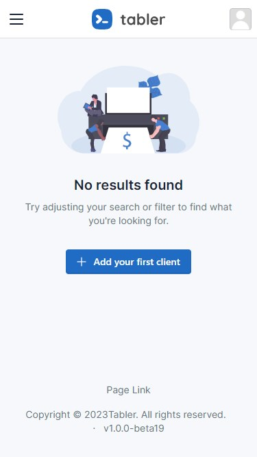

# react-tabler


Build a react application using nextjs with tabler

## Getting Started
```bash
git clone https://github.com/alphasnow/react-tabler.git
cd react-tabler
npm install
npm run dev
```

## Preview



## Dependencies
- tabler-ui
- nextjs
- reactjs
- nodejs
- typescript

## License
This project is licensed under the [Apache License (Version 2.0)](LICENSE).